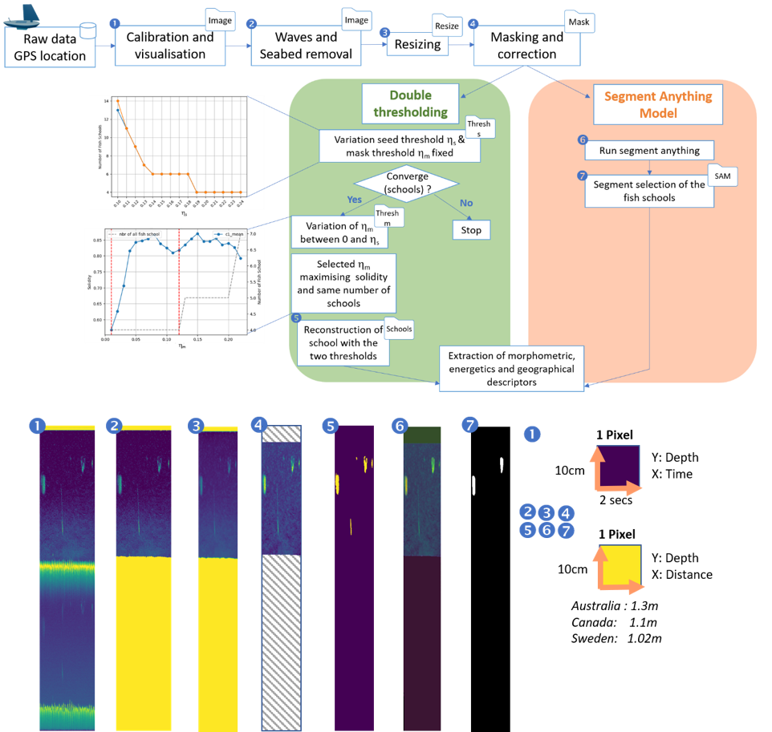

User Documentation
==================

About Echoedge
----------------

Echoedge is a software for processing echograms collected by echosounder and automatic detection of fish schools.

It is a free software released under the `Apache license
<http://www.apache.org/licenses/LICENSE-2.0>`_.

The source code can be obtained from the Github repository:
https://github.com/liliaguillet/echoedge.git

Input file
---------------------

The proccessing and automatic fish schools can be tuned with the following parameters:

* Input file: Acoustic data *.raw* , the gps location associated *.csv*,
parameters of the echosounder (calibration) and processing  *.yaml*. Their details description can be found
in echoedge_parameters.pdf

Output File
-----------

* Output file: selection of the path and the name of the output file.

The results of the analysis are saved in the *output folder*. In *preprocess_data* folder there are the result of the NASC,
bathymetry and waves depth per echogramin *Csv* as *.csv* a *.xsls* with the details variable is available in *preprocess paramater output*  , the visulisation of the echogram before/after seabed and waves
removal *.png* in Img and *.npy* in npy, the santardised echogram (constant velocity) in Resize as *.png* and *.npy* and 
the masked images used later for Segment Anything processing as *.png*. After there are two other flders with the results
of the schools extraction as *.png* and *.csv* wth the details of the morphometric descriptions.

Here the process.The detail description of the process can be found in the article : **comming soon**

Processing example
---------------------

You can run an example with a *.raw* obtain from a USV (Uncrewed Surface Vehicle) was deployed around Phillip Island,to survey the preyscape of little penguins (Eudyptula minor) in Bass Strait.
Before change the path in *segment_anything_run.py* of the checkpoint for SAM.
After you can run *run_all.py* look for the results.

TEP 1 = Before running the example, ensure the following:

(i) Python environment :

- A virtual environment is recommended :
python -m venv venv_echoedge
source venv_echoedge/bin/activate

- Install dependencies:
pip install -r requirements.txt

(ii) Segment Anything Model (SAM)

- The checkpoint file sam_vit_h_4b8939.pth must be downloaded and placed in an accessible directory (https://github.com/facebookresearch/segment-anything/tree/main)

- The script segment_anything_run.py must point to the correct path of the sam_vit_h_4b8939.pth file :
sam = sam_model_registry["vit_h"](checkpoint="/path/to/SAM/sam_vit_h_4b8939.pth")

STEP 2 = Running the example

- From the project root directory (processing_example/), launch the main script :
python3 run_all.py

- When the histogram of all velocities is displayed (Resize.py), close the plot window manually to allow the script to continue.

- View results in the Ouput/ folder. 

Credits
-------

The main contributors to the Echoedge project are:
 
* Joakim Eriksson

* Jonas Hentati-Sundberg

* Lilia Guillet

* Jiao Liu 

* Quentin Queiros

* Thao Phuong Sofia Nguyen

Echoedge is Copyright © 2022 CNRS, University of Strasbourg, SLU 
